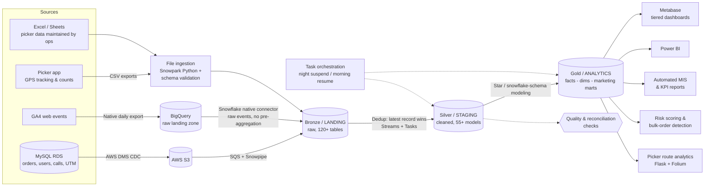
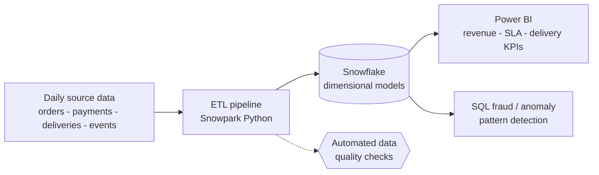
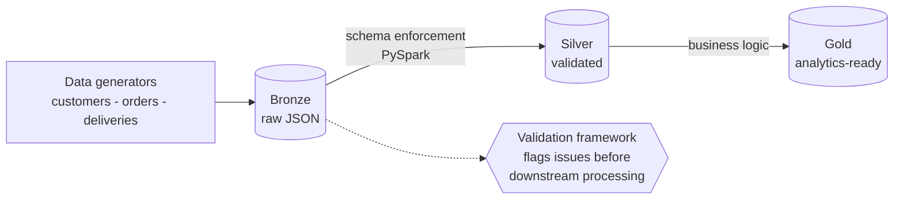

<h1 align="center">Hi 👋, I'm Shivam Mishra</h1>

  

  <b>I build the analytics infrastructure businesses actually run on</b> — Snowflake warehouses, automated pipelines, and dashboards leadership trusts.

  
  
  
  

---

## 🎯 At a Glance

| 🧭 Role | 🏢 Currently | 📍 Based in | 🎓 Education |
|---|---|---|---|
| Analytics Engineer / Data Analyst | Attero Recycling (Product & Logistics Analytics) | Noida, India | B.Tech ECE, 8.4 CGPA |

**2.5 years** of experience owning reporting ecosystems end to end: requirements → Snowflake models → automated pipelines → Metabase / Power BI dashboards.

---

## 🏆 Business Impact

<table align="center">
<tr>
<td align="center" width="25%"><h2>150+ hrs</h2>manual reporting effort eliminated <b>every month</b></td>
<td align="center" width="25%"><h2>30%</h2>Snowflake compute cost reduced via Streams + Tasks re-architecture</td>
<td align="center" width="25%"><h2>5–8 min → 30 sec</h2>order-status investigation time</td>
<td align="center" width="25%"><h2>Days → Minutes</h2>reporting turnaround</td>
</tr>
</table>

- 🛡️ **Risk scoring engine:** SQL-driven framework on **30+ data signals**, replacing a manual review that took up to **10 min per order**
- 👥 **Picker Operations Analytics:** automated visibility into pickup performance and staffing, replacing a **5-person manual process**
- 🧩 **Single source of truth:** centralized Snowflake warehouse (Medallion architecture) serving IT, Business, Logistics, Operations, Marketing and Finance
- ❄️ **Production platform, end to end:** MySQL RDS → AWS DMS (CDC) → S3 → Snowpipe → Medallion layers (120+ landing tables, 55+ staging models, 30+ analytics tables) with orchestration, monitoring, RBAC and runbooks
- 📣 **Marketing data, built from scratch:** GA4 → BigQuery → Snowflake pipeline plus a UTM-to-order funnel layer, so campaign performance is measured on real backend orders instead of platform-reported conversions
- 🔍 **Product & ops insight:** funnel drop-off analytics, route-adherence clustering, and SQL root-cause analysis that led to a data-backed 70:30 fresh-to-rescheduled order allocation strategy

---

## 🧰 Tech Stack

**Data Engineering & Warehousing**

**Languages & Processing**

**BI & Visualization**

**Tools & Workflow**

**Concepts:** Multi-source Ingestion · CDC Ingestion · Snowpipe · Medallion Architecture · Task Orchestration · RBAC / Least Privilege · Star Schema · ETL/ELT · Streams & Tasks · Dynamic Tables · Incremental Processing · Data Quality & Validation · Root-Cause Analysis · Funnel / Cohort / A/B Analysis

---

## 🏗️ How I Build: Reference Architecture

> **Design principles:** one source of truth · incremental over full refresh (cost-aware) · reconcile every automated number against the source before anyone trusts it · automate anything done more than twice.

---

## 🧭 What I Do at Work

<table>
<tr>
<td width="50%" valign="top">

### 📣 Marketing Analytics
- GA4 tracking plan, event/conversion validation and UTM structure
- **GA4 → BigQuery → Snowflake** raw-data pipeline: GA4 exports raw events to BigQuery, a Snowflake connector replicates them as-is, and flattening, sessionization and channel marts are built in Snowflake (ELT)
- Customer-journey funnel: **session → registration → order**, with drop-off % at every stage
- Campaign performance by UTM source/campaign on **backend-confirmed orders**
- Reconciliation of GA4 / ad-platform numbers against warehouse orders (attribution windows, cross-browser gaps, consent loss)

</td>
<td width="50%" valign="top">

### 🧪 Product Analytics
- Metric framework: **activation, retention, engagement, funnel drop-offs**
- Config-driven funnel model (one dimension table controls every stage)
- Monthly and daily funnel views with step-conversion and drop-off %
- Churn / leakage tracking: cancellations and account deletions
- Insights delivered to Product via tiered Metabase dashboards

</td>
</tr>
<tr>
<td width="50%" valign="top">

### 🚚 Operational Analytics
- **Picker Operations Analytics:** pickup performance and warehouse staffing visibility, replacing a 5-person manual process
- **Order & Picker Journey Tracker:** status investigation from ~5-8 min to under 30 sec
- **Route-adherence analytics** using geolocation clustering
- SQL root-cause analysis of declining pickup performance, leading to a 70:30 fresh-to-rescheduled allocation strategy
- SLA and business-health monitoring for leadership

</td>
<td width="50%" valign="top">

### 🛡️ Risk & Data Platform
- SQL risk scoring on **30+ signals** replacing a ~10-min manual order review
- Upgrading bulk-order detection to a **graph-network method** in Snowflake (nodes: orders and entities, edges: shared attributes)
- **CDC ingestion** (DMS → S3 → Snowpipe) and Medallion warehouse with Streams + Tasks (30% lower compute)
- Automated MIS / KPI reporting across SQL, Python, Snowflake and Metabase
- Validation checks before data reaches a dashboard

</td>
</tr>
</table>

---

## 💼 Professional Experience

### Data Analyst · Attero Recycling
Jun 2025 – Present &nbsp;|&nbsp; Noida, India &nbsp;|&nbsp; Product & Logistics Analytics

Owns the end-to-end reporting ecosystem for a reverse-logistics business: requirements → Snowflake models → automated pipelines → Metabase dashboards.

**❄️ Data platform & engineering**
- Built a centralized Snowflake warehouse (Medallion architecture) consolidating application and operational sources, fed by a CDC pipeline (MySQL → AWS DMS → S3 → Snowpipe)
- **Multi-source ingestion:** unified CDC data, GA4 raw events, picker-app GPS exports and Excel-maintained picker data into one governed warehouse; file-based sources are loaded with **Snowpark Python** and schema validation
- Re-engineered high-cost Dynamic Table workflows into incremental Streams + Tasks, **cutting compute 30%** while keeping near-real-time freshness
- Task orchestration with dependency-ordered resume, nightly suspend and pipeline health monitoring

**📣 Marketing & product analytics**
- Marketing funnel analytics across the customer journey to pinpoint conversion drop-offs and guide campaign decisions
- GA4 raw events replicated BigQuery → Snowflake through a native connector, modeled in Snowflake and reconciled against backend orders *(in progress)*
- Tiered Metabase reporting for leadership and functional teams (KPIs, SLAs, business health)

**🚚 Operations analytics**
- **Picker Operations Analytics** replacing a 5-person manual process
- **Order & Picker Journey Tracker:** investigation time from ~5-8 min to under 30 sec
- Route-adherence analytics using geolocation clustering
- SQL root-cause analysis of declining pickup performance, leading to a 70:30 fresh-to-rescheduled allocation strategy

**🛡️ Risk & automation**
- SQL-driven risk scoring on 30+ data signals, eliminating a manual review of up to 10 min per order
- Automated MIS and KPI reporting (SQL, Python, Snowflake, Metabase): **150+ hours/month saved**

### Data Analyst · AlphaMetrics International
Jan 2024 – Mar 2025 &nbsp;|&nbsp; Remote &nbsp;|&nbsp; Multi-vertical Analytics

- Built Power BI and Tableau dashboards tracking revenue trends and KPIs across multiple business verticals
- Ran funnel, cohort, A/B and ROI analyses to inform marketing and sales strategy
- Automated SQL and Python ETL workflows, accelerating data delivery and cutting manual effort
- Strengthened dataset reliability through validation, QA and governance practices

> 🔒 *Work projects are described at a high level because the code and data belong to my employer. The projects below are my own.*

---

## 🧪 Personal Projects

### 📦 [Logistics Analytics Platform](https://github.com/Shivam24012001/logistics-snowpark-platform)
`Snowflake` `Snowpark Python` `SQL` `Power BI`

End-to-end analytics solution across **orders, payments, deliveries and operational events**.

- Dimensional models (orders, customers, payments, deliveries) supporting analysis across the **full order lifecycle**
- Power BI dashboards for **revenue KPIs, SLA adherence and delivery performance**
- SQL pattern matching to surface suspicious ordering behaviour
- Reusable transformation logic designed for scale

### ⚙️ Enterprise Real-Time Data Platform
`Python` `PySpark` `Bronze-Silver-Gold` `JSON`

Modular data platform covering **ingestion → processing → validation → analytics-ready layers**.

- Reusable **PySpark components** for processing structured JSON with predefined schemas
- **Validation framework** that flags data-quality issues *before* downstream processing
- Modular **Bronze-Silver-Gold** structure for scalable transformation
- Automated data-generation workflows for logistics datasets (customers, orders, deliveries)

<!-- Add repo link once public: ### ⚙️ [Enterprise Real-Time Data Platform](https://github.com/Shivam24012001/<repo-name>) -->

---

## 🌱 Currently Learning & Building

I'm going deeper into **data engineering**: distributed processing, advanced Snowflake, the Google Cloud data stack, and AI agents that automate my own recurring work.

| Focus | What I'm exploring |
|---|---|
| ⚡ **PySpark** | Distributed processing, schema enforcement, partitioning and performance tuning, structured streaming |
| ❄️ **Advanced Snowflake** | Streams & Tasks, Dynamic Tables, Snowpark, clustering and query optimization, cost governance, RBAC |
| ☁️ **GCP & BigQuery** | Partitioned / clustered tables, scheduled queries, Dataform, cost controls, BigQuery → Snowflake raw replication via connector, ELT modeling in Snowflake |
| 📊 **GA4 data engineering** | Event export schema, session and attribution modeling, reconciliation against backend orders |
| 🤖 **AI agents for automation** | Agents that run my routine tasks: report refresh and checks, pipeline health summaries, anomaly explanations, stakeholder updates |
| 🧱 **dbt & orchestration** | Tested, versioned transformations, Airflow-style scheduling, CI/CD for analytics |
| 🕸️ **Graph methods in SQL** | Network-based bulk-order and fraud-ring detection |

---

## 🟢 Open to Work

<table>
<tr>
<td>

**Looking for roles in:**
- 🏗️ Data Engineering (Snowflake, PySpark, pipelines)
- 🔧 Analytics Engineering
- 📈 Senior Data Analyst / Product Analytics

</td>
<td>

**What I bring:**
- Snowflake + Medallion architecture in production
- Measurable cost and time savings
- Stakeholder-to-SQL translation across 6+ functions

**Work mode:** Remote · Hybrid · On-site (India)

</td>
</tr>
</table>

  <a href="https://www.linkedin.com/in/shivammishra-sm/"><b>📩 Let's connect on LinkedIn</b></a> &nbsp;·&nbsp; <a href="mailto:sm8954223@gmail.com"><b>✉️ Email me</b></a>

<i>Building analytics infrastructure that drives decisions.</i>

